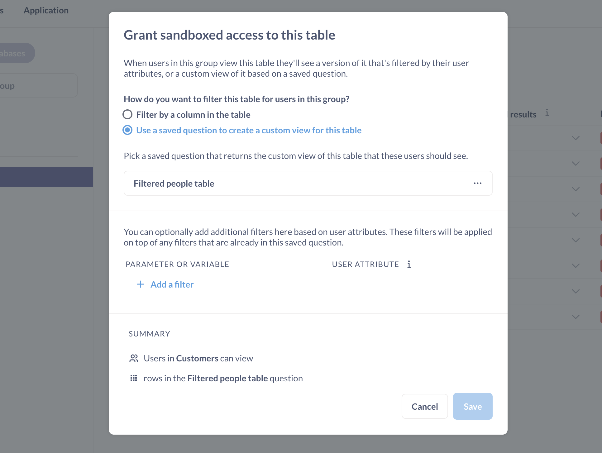
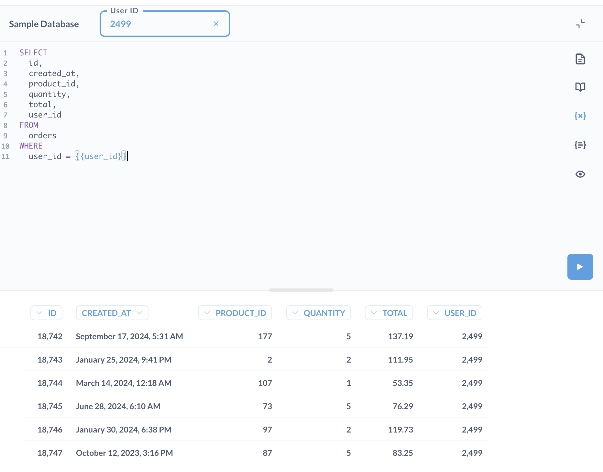
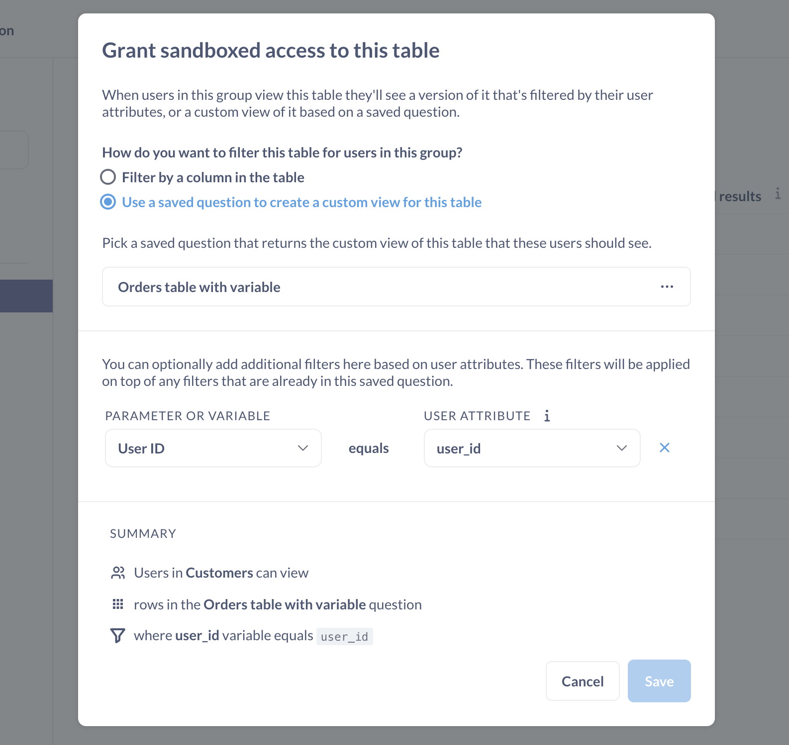
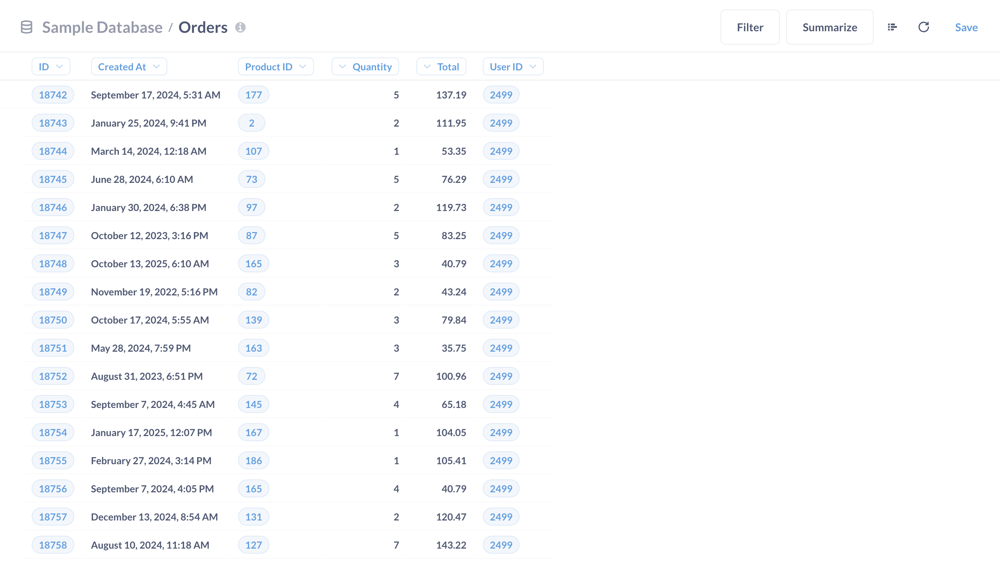

# Data sandbox examples



[Data sandboxes](./data-sandboxes.md) are a set of permissions that show different data to different people. You can:

- Restrict **rows** using a [basic sandbox](./data-sandboxes.md#basic-data-sandboxes-filter-by-a-column-in-the-table).
- Restrict **columns**  (and rows) using a [custom sandbox](./data-sandboxes.md#custom-data-sandboxes-use-a-saved-question-to-create-a-custom-view-of-a-table).

Permissions are always a bit pesky to set up, so here are some examples to get you started. (The example happens to use a group called "Customers" but this works the same whether you're doing this for internal or external use cases.)

## Basic sandbox setup - filtering rows based on user attributes

In this example, we’ll sandbox our `Orders` table so that anyone in our Customers group will only be able to see rows in the Orders table where the `User ID` column matches the person's `user_id` attribute.

1. [Create a user account](#1-create-a-user-account).
2. [Add a user attribute](#2-add-a-user-attribute-to-the-account).
3. [Create a group called Customers and add that account to the group](#3-create-a-group-and-add-the-user-account-to-that-group).
4. [Create a sandbox for that group for the Orders and People tables](#4-create-a-sandbox-for-that-group-for-the-orders-and-people-tables).

### 1. Create a user account

First, we'll create a user based on our a random person from the People table in our Sample Database. We'll go with `Cloyd Beer`.

### 2. Add a user attribute to the account

We'll add a user attribute to Cloyd's account. Since we want to be able to filter the data by user ID, we'll grab Cloyd's user Id from the Sample database and add the ID as a user attribute: `user_id: 2499` (`2499` is Mr. Beer's ID in the Sample database).


### 3. Create a group and add the user account to that group

[Create a group](../people-and-groups/managing.md#creating-a-group), call the group "Customers" and [add Mr. Beer to the Customers group](../people-and-groups/managing.md#adding-people-to-groups).

### 4. Create a sandbox for that group for the `Orders` and `People` tables

In the **Permissions** tab, click on the Customers group.

For the Sample Database, set [View data](./data.md#view-data-permissions) to "Granular". This will allow us to set up permissions on individual tables. Here, we'll set the View data permissions on the `Orders` and `People` tables to "Sandboxed".

And since we want people to self-serve their data (by asking questions, creating dashboards, etc), we'll also set their [Create queries](../permissions/data.md#create-queries-permissions) to "Query builder only."


For each table, Metabase will ask us "How do you want to filter this table for users in this group?". In each case, we'll keep the default selection: "Filter by a column on this table."

For the `Orders` table, we'll filter by the `User ID` column, which we'll set equal to the `user_id` attribute for people in the Customers group.


For the `People` table, we'll filter by the `ID` column, which we'll set equal to that same `user_id` attribute.

Be sure to save your changes.

### Testing out the basic sandbox

To test out Mr. Beer's sandbox, we’ll open up a new incognito/private browser window and log in using Mr. Beer's account.

1. Log in as Cloyd Beer.
2. Click **Browse data**.
3. Click on the **Orders** table.
5. Confirm that Metabase displays only the orders that Mr. Beer placed, that is, orders associated with the User ID of `2499`.

If Mr. Beer views any charts, dashboards, or even automated [X-ray explorations](../exploration-and-organization/x-rays.md) that include this sandboxed `Orders` data, Metabase will also filter those results to show only the data Mr. Beer is permitted to see. When Mr. Beer uses the query builder to ask new questions, his results will be limited to the sandboxed data.

## Custom sandbox setups

The second way you can create a sandbox is by using a saved question to define a customized view of a table to display. When someone with sandboxed access to a table queries that table, behind the scenes Metabase will instead use the saved question you created as the source data for their query.

You can:

- [Filter out columns](#custom-example-1-filtering-columns)
- [Filter out rows and columns](#custom-example-2-filtering-rows-and-columns)

## Custom example 1: filtering columns

In this example, I have a table called `People` that I want to trim down so that Mr. Beer and other Customers can view any row, but only some columns.


So I can create a query that only returns the columns in that table that I _do_ want them to see, like this:

```sql
  ID,
  Name,
  'Created At',
  State
FROM
  People
```

Here are the results:


Now, when we go to the Permissions section and grant this group sandboxed access to this table, we'll select the second option, "Use a saved question to create a custom view for this table", and select the saved question we just created, like so:



To verify things are working correctly, we can log in as Mr. Beer, and when we go to open up the `People` table, we should see that Mr. Beer can instead see the results of the filtering question:


**Note:** When Mr. Beer views a chart that uses data from the sandboxed table, Metabase will also apply the filtering. If the chart uses any columns that aren't included in the sandboxed version of the table, the chart will NOT load for Mr. Beer.

## Custom example 2: Filtering rows and columns

If you want to determine which columns AND rows people can view, you can sandbox a table based on a SQL question with a variable, and associating that variable with a user attribute.

Let's give Customers a custom view of the `Orders` table, but only let each person see rows based on their `user_id` user attribute.

We'll create a query that selects only some of the columns from the `Orders` table, and then adds a `WHERE` clause with a variable that we can associate with Cloyd Beer's `user_id` user attribute.



And here's the code:

```sql

SELECT
  id,
  created_at,
  product_id,
  quantity,
  total,
  user_id
FROM
  orders
WHERE
  user_id = {{user_id}}

```

Save that question to a collection that only Admins have access to.

Return to the **Permissions** tab.

Select Cloyd Beer's Customer group, and set the **View data** access for the `Orders` table to **Sandboxed**.

Select **Use a saved question to create a custom view for this table**.

Open up the sandboxed access modal and select the second option and select my filtering question, we'll see an additional section which allows me to map the variable we defined in our question with a user attribute:



Now, when we log in as Mr. Beer and look at the `Orders` table, Mr. Beer will only see the columns we included in the filtering question, and the rows are filtered as specified by the variable in the question's  `WHERE` clause:



## Further reading

- [Basic sandboxes: setting row-level permissions](https://www.metabase.com/learn/permissions/data-sandboxing-row-permissions)
- [Custom sandboxes: limiting access to columns](https://www.metabase.com/learn/permissions/data-sandboxing-column-permissions)
- [Configuring permissions for different customer schemas](https://www.metabase.com/learn/permissions/multi-tenant-permissions)
